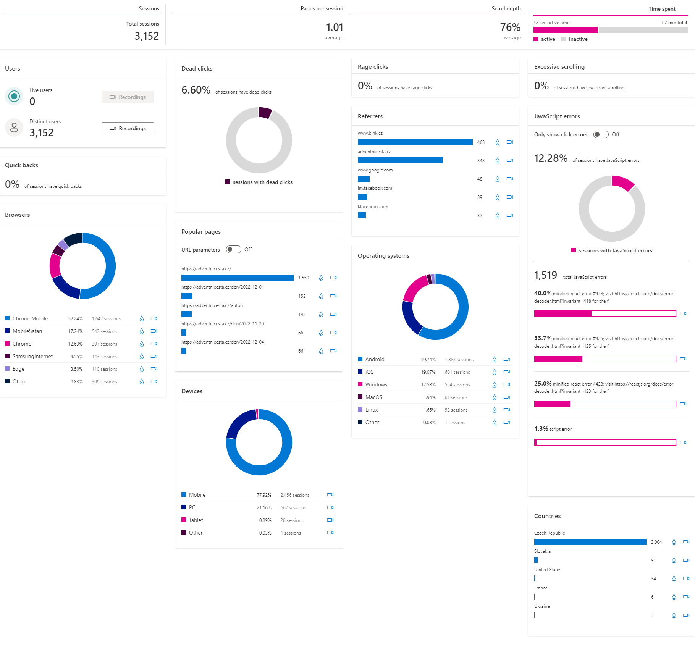
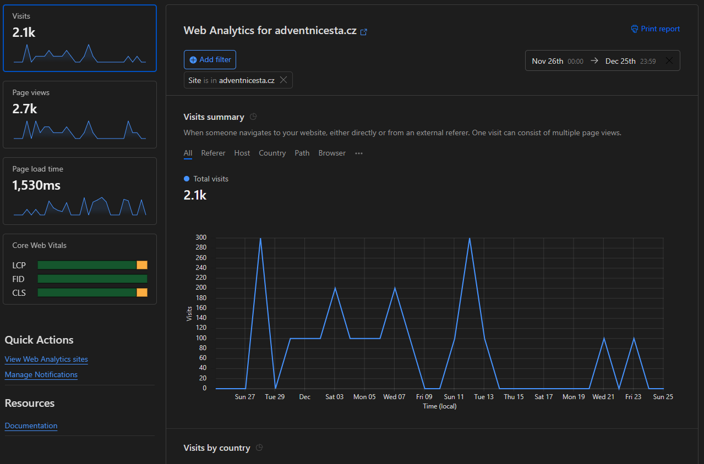
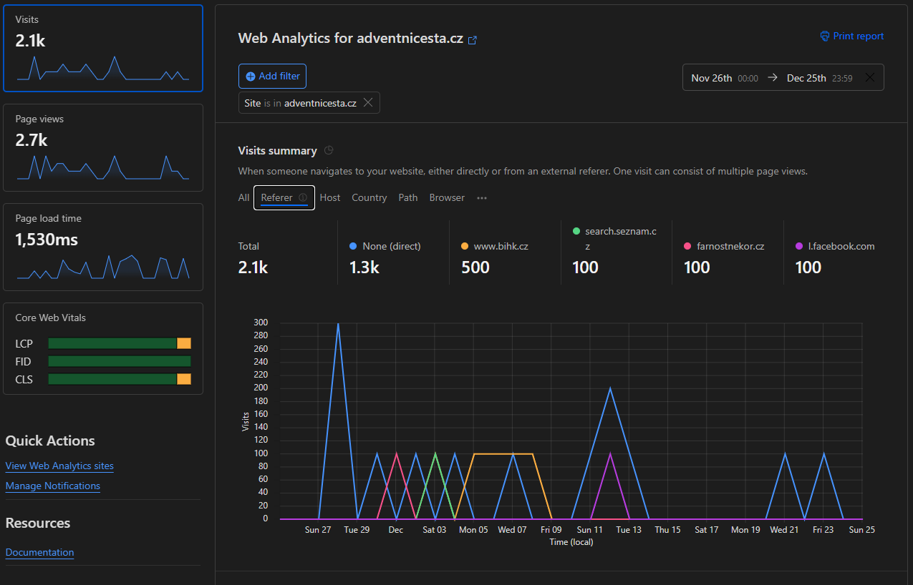
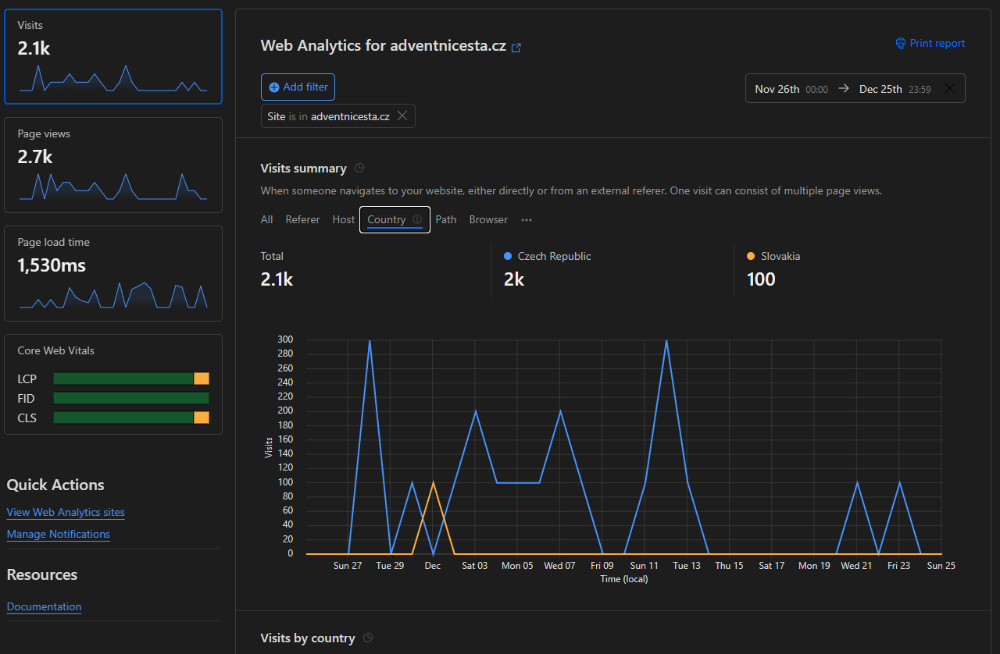
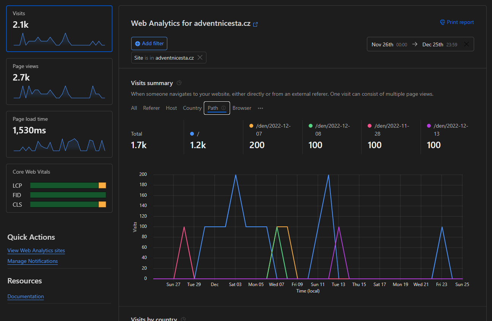
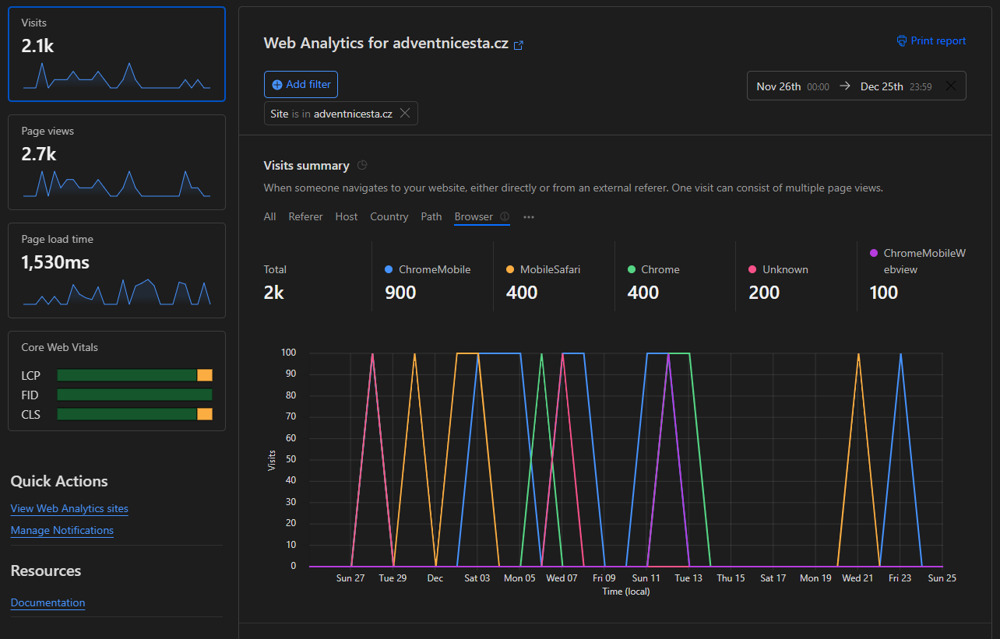
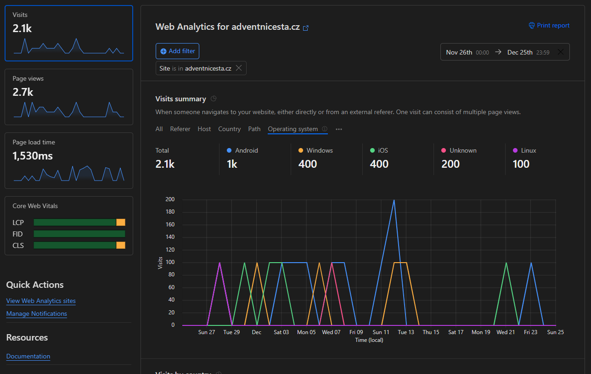
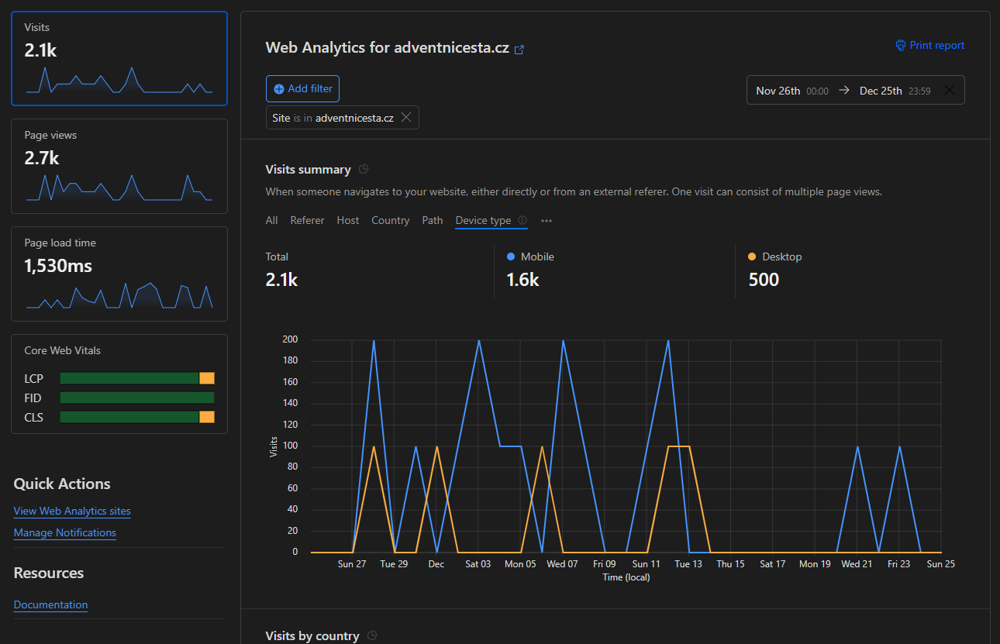

# Zpětná vazba k adventu 2022

## Dotazník

### Interpretace výsledků

Lidé používali aplikaci na mobilu. Úvodní obrazovak i text jsou přehledné. Poslouchali audionahrávky. V narhávkách by bylo dobré zlepšit syntetizaci slov jako Jesus atd.

Uživatelé by takovýchto zamyšlení uvítali rádi více.

### Popis vzorku

Na dotazník neodpovědělo veliké množství lidí. To bylo pravděpodobně způsobeno tím, že aplikace nebylo nijako hodně čtená a především tím, že tlačítko bylo v spodní části stránky.

## Microsoft Clarity

*Hodnoty jsou v časovém rozmezí: 11/26/2022 - 12/26/2022.*

## Cloudflare

Na aplikaci nebyl proveden žádný útok, který by byl zachycen Cloudflarem.

## Google Search Console

Web dělán na posledni chvíli a proto špatně indexován. Více viz složka `search-console`.

## Obecně

- notifikace vedou více lídí
- lepší propagace
- vyrobit dříve - lepší indexace